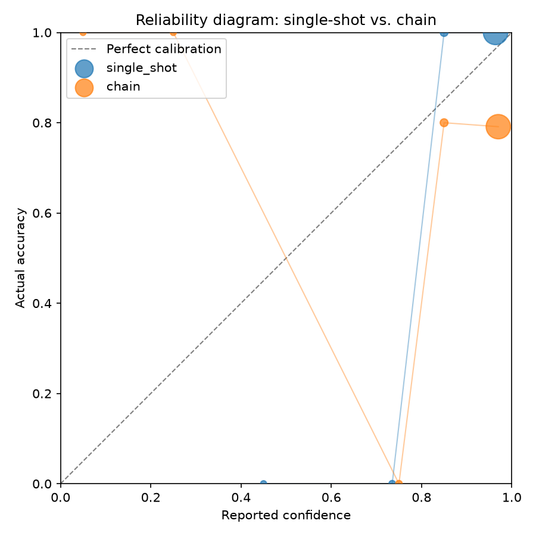

# LLM Chain Calibration

Does a multi-agent pipeline systematically overestimate its own reliability
compared to a single model call on the same task?

## Status

**First result in.** Confirmed on 100 GSM8K problems: the three-agent chain
is both less accurate and substantially worse calibrated than a single
model call. See below, and [`docs/napredak_projekta.md`](docs/napredak_projekta.md)
for the full log.

## Result

| Metric | Single-shot | Chain (Planner → Executor → Verifier) |
|---|---|---|
| Accuracy | 97.0% | 78.0% |
| ECE | 0.0598 | 0.1973 |
| Brier score | 0.0155 | 0.2079 |

Bootstrap 95% CI for ECE(single-shot) − ECE(chain): **−0.1375, [−0.2262, −0.0641]**
— the interval excludes zero, so the gap is statistically significant, not
noise (2000 resamples).



The chain doesn't just carry the same errors with more confidence — it
introduces additional errors that the single-shot call didn't make, and its
reported confidence doesn't track that drop in accuracy. Full numbers in
[`results/summary.json`](results/summary.json).

## Idea

When a model solves a problem on its own and reports how confident it is in
the answer, that confidence is usually reasonably well calibrated — if it
says 80%, it tends to be right about 80% of the time. This project tests
whether that calibration breaks down when the same problem is solved not by
one model call but by a three-agent chain (Planner → Executor → Verifier),
where each step inherits the previous step's errors while still reporting
high confidence.

## Method (as run)

- **Model:** `claude-haiku-4-5` via the Claude API directly, `temperature=0`,
  no extended thinking in either condition — deliberately, so the only
  difference between conditions is the pipeline structure, not how much the
  model internally reasons.
- **Task domain:** 100 GSM8K problems, filtered to `n_steps >= 5`
  (calculator annotations in the reference solution) — an accuracy probe
  showed GSM8K is too easy for Haiku 4.5 at full difficulty (100% on a
  20-problem sample), leaving no errors to measure calibration against.
- **Condition A — single-shot:** one call, model solves the problem and
  reports confidence (0–100%) in the same response.
- **Condition B — chain:** Planner breaks the problem down (confidence in
  the plan) → Executor carries it out (confidence in the answer) → Verifier
  checks the result (confidence in the final answer = "system confidence").
  Each stage sees only the previous stage's **text output**, never its
  confidence — this is what the calibration hypothesis actually tests.
- **Metrics:** Expected Calibration Error (ECE, 10 bins), Brier score,
  reliability diagram, bootstrap 95% CI on the ECE difference (2000
  resamples).

Full scope decisions and the week-by-week plan (in Serbian) are in
[`docs/plan_projekta.md`](docs/plan_projekta.md); the day-by-day log is in
[`docs/napredak_projekta.md`](docs/napredak_projekta.md).

## Reproducing

```bash
uv venv --python 3.12
source .venv/bin/activate
uv pip install -r requirements.txt
cp .env.example .env   # fill in ANTHROPIC_API_KEY

python -m scripts.download_data
python -m scripts.run_experiment      # ~400 API calls, ~$0.75
python -m scripts.analyze_results
```

`scripts/run_experiment.py` writes incrementally and resumes on re-run, so
an interrupted run is safe to restart. `config/config.py` holds the model,
sample size, difficulty filter, and a hard spend limit (`MAX_SPEND_USD`).
